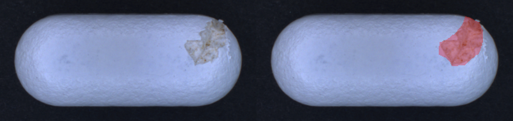

# DeepLabV3 Crack Segmentation with Dice Loss

A PyTorch-based semantic segmentation project for detecting cracks in pill/ginseng images, using **DeepLabV3** with a custom **Dice Loss** to handle severe class imbalance between background and crack regions.

---

## Table of Contents

- [Motivation: Why Dice Loss?](#motivation-why-dice-loss)
- [Project Structure](#project-structure)
- [Getting Started](#getting-started)
- [Dataset Preparation](#dataset-preparation)
- [API Usage](#api-usage)
  - [Set Dataset Paths](#1-set-dataset-paths)
  - [Train the Model](#2-train-the-model)
  - [Run Inference](#3-run-inference)
- [Example Output](#example-output)
- [License](#license)

---

## Motivation: Why Dice Loss?

In crack segmentation tasks, crack pixels (class 1) are heavily outnumbered by background pixels (class 0). Training with standard **Binary Cross-Entropy (BCE)** loss causes the model to be biased toward the majority class (background), resulting in poor crack detection.

### Binary Cross-Entropy Loss

$$\mathcal{L}_{BCE} = -\frac{1}{N} \sum_{i=1}^{N} \left[ y_i \log(\hat{y}_i) + (1 - y_i) \log(1 - \hat{y}_i) \right]$$

BCE treats each pixel independently and equally — so if 95% of pixels are background, the model can achieve 95% accuracy by predicting all background, while completely missing the cracks.

### Dice Loss

$$\mathcal{L}_{Dice} = 1 - \frac{2 \sum_{i} y_i \hat{y}_i + \epsilon}{\sum_{i} y_i + \sum_{i} \hat{y}_i + \epsilon}$$

where $y_i$ is the ground truth mask, $\hat{y}_i$ is the predicted probability, and $\epsilon$ is a small smoothing constant (e.g., `1e-6`) to prevent division by zero.

| Property | BCE Loss | Dice Loss |
|---|---|---|
| Treats pixels equally | ✅ | ❌ |
| Handles class imbalance | ❌ | ✅ |
| Optimizes overlap directly | ❌ | ✅ |
| Sensitive to small structures | ❌ | ✅ |

Dice Loss directly maximizes the overlap between predicted and ground-truth crack regions, making it much more robust when cracks occupy only a small fraction of the image.

---

## Project Structure

```
.
├── app.py                   # FastAPI application entry point
├── src/
│   ├── dataset_ver1.py      # Dataset class and augmentation transforms
│   ├── train_with_DiceLoss.py  # Training loop with Dice Loss
│   └── test_ver1.py         # Batch inference utilities
├── data/                    # Dataset folders (excluded from git)
│   ├── train/
│   │   ├── images/          # Training images
│   │   └── masks/           # Training masks (same filenames as images)
│   └── test/
│       ├── images/          # Test images
│       └── masks/           # Test masks (same filenames as images)
├── model/                   # Saved model weights (excluded from git)
├── result/                  # Inference outputs (excluded from git)
├── requirements.txt         # Python dependencies
└── README.md
```

---

## Getting Started

### 1. Create a virtual environment

```bash
python -m venv .venv

# Windows
.venv\Scripts\activate

# macOS/Linux
source .venv/bin/activate
```

### 2. Install dependencies

```bash
pip install -r requirements.txt
```

### 3. Launch the API server

```bash
python app.py
```

The server starts at `http://127.0.0.1:8001` and automatically opens the interactive Swagger UI at `http://127.0.0.1:8001/docs`.

---

## Dataset Preparation

### Directory Layout

```
data/
├── train/
│   ├── images/
│   │   ├── crack_001.png
│   │   ├── crack_002.png
│   │   └── ...
│   └── masks/
│       ├── crack_001.png    ← must match image filename exactly
│       ├── crack_002.png
│       └── ...
└── test/
    ├── images/
    │   ├── crack_101.png
    │   └── ...
    └── masks/
        ├── crack_101.png    ← must match image filename exactly
        └── ...
```

> **Important:** Each image and its corresponding mask **must share the exact same filename** (including extension). The dataset loader pairs them by name. Mismatched filenames will cause loading errors.

### Mask Format

- Masks must be **single-channel (grayscale)** images.
- Pixel values: `0` = background, `1` (or `255`, normalized internally) = crack.
- Supported formats: `.png`, `.jpg`, `.jpeg`, `.bmp`.

---

## API Usage

Once the server is running, you can interact with the model through the following endpoints. Use the Swagger UI at `/docs` or any HTTP client (e.g., `curl`, Postman).

### 1. Set Dataset Paths

Before training, tell the API where your images and masks are stored.

**Endpoint:** `POST /set_dataset_path`

| Parameter | Type | Description |
|---|---|---|
| `image_dir` | `str` | Absolute or relative path to the images folder |
| `mask_dir` | `str` | Absolute or relative path to the masks folder |

**Example:**
```bash
curl -X POST "http://127.0.0.1:8001/set_dataset_path" \
  -H "Content-Type: application/json" \
  -d '{"image_dir": "data/train/images", "mask_dir": "data/train/masks"}'
```

---

### 2. Train the Model

Start training DeepLabV3 with Dice Loss. The dataset paths must be set first.

**Endpoint:** `POST /train`

| Parameter | Type | Default | Description |
|---|---|---|---|
| `backbone` | `str` | `mobilenet_v3_large` | Backbone architecture (`mobilenet_v3_large` or `resnet50`) |
| `epochs` | `int` | `3` | Number of training epochs |
| `num_classes` | `int` | `2` | Number of segmentation classes (background + crack) |
| `batch_size` | `int` | `2` | Batch size for training |
| `lr` | `float` | `1e-3` | Learning rate |
| `img_width` | `int` | `300` | Input image width (pixels) |
| `img_height` | `int` | `150` | Input image height (pixels) |

The dataset is automatically split **80% train / 20% validation** before training begins. The best model weights are saved to:

```
model/best_deeplabv3_{backbone}_segmentation.pth
```

**Example:**
```bash
curl -X POST "http://127.0.0.1:8001/train?backbone=resnet50&epochs=20&batch_size=4&lr=0.0005"
```

---

### 3. Run Inference

Run batch inference on a directory of images using the trained model.

**Endpoint:** `POST /inference`

| Parameter | Type | Description |
|---|---|---|
| `image_dir` | `str` | Path to the folder containing images for inference |

Results (overlay images) are saved to the `./result/` directory. Image size and backbone are automatically inferred from the last training session.

**Example:**
```bash
curl -X POST "http://127.0.0.1:8001/inference?image_dir=data/test/images"
```

You can also call inference directly in Python:

```python
from src.test_ver1 import batch_inference

batch_inference(
    backbone='resnet50',
    image_dir='data/test/images',
    model_path='model/best_deeplabv3_resnet50_segmentation.pth',
    output_dir='result',
    num_classes=2,
    img_size=(150, 300)   # (height, width)
)
```

---

### Check Status

**Endpoint:** `GET /status`

Returns whether a model has been trained and which compute device is available.

```json
{
  "trained": true,
  "training": false,
  "device": "cuda"
}
```

---

## Example Output

The image below shows a predicted overlay for `predicted_pill_ginseng_crack_007.png`. Crack regions detected by the model are highlighted in the overlay.



---

## Recommended `.gitignore` Rules

```
data/
model/
result/
*.pth
*.pt
.venv/
__pycache__/
```

---

## License

This project is licensed under the MIT License. See [`LICENSE`](LICENSE) for details.
